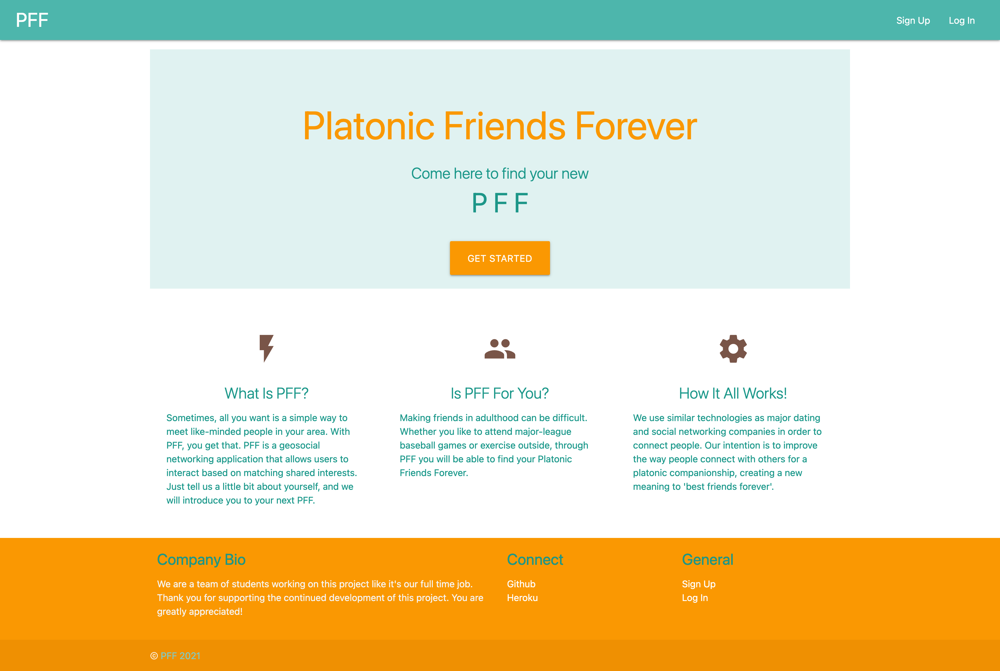
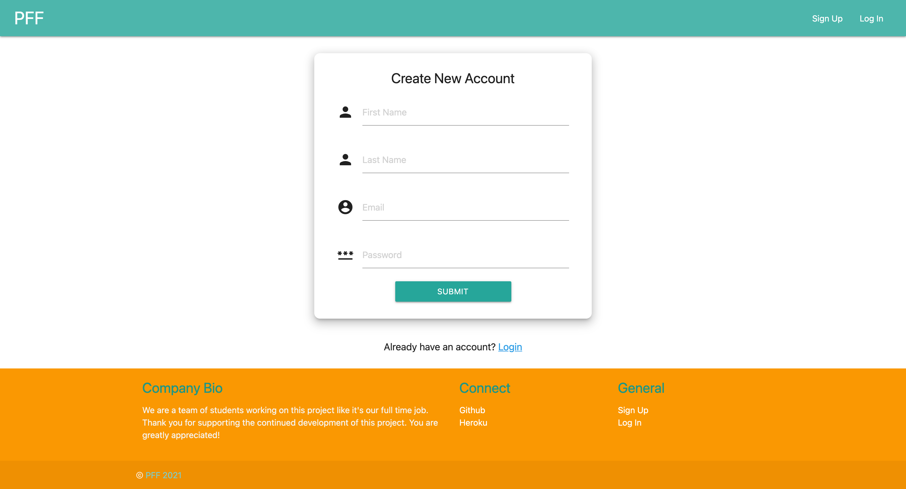
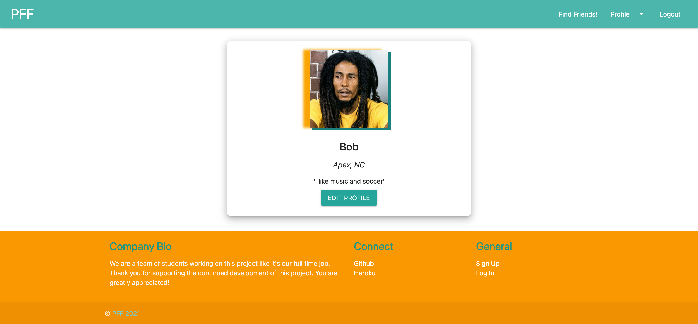

# 🎣 PFFs (Platonic Friends Forever)

A simple way to meet like-minded people in your area, PFF matches people based on their shared interests. Whether you like to attend major-league baseball games or play video games, through PFF you will be able to find your Platonic Friends Forever.

The application uses the [express-handlebars](https://www.npmjs.com/package/express-handlebars) package to implement Handlebars.js for Views, the [MySQL2](https://www.npmjs.com/package/mysql2) and [Sequelize](https://www.npmjs.com/package/sequelize) packages to connect to a MySQL database for Models, and an [Express.js](https://expressjs.com/) API for Controllers.

---

## User Story
```
AS A person who wants to make new friends
I WANT an application that will match me with people in my area 
SO THAT I can meet new people nearby who share the same interests
```

## Link to Deployed Application

[Deployed Application](https://pfforever.herokuapp.com/)

## Table of Contents

- [Technologies](#technologies)
- [Functionality](#functionality)
- [Challenges](#challenges)
- [Future Development](#future-development)
- [Contact](#contact)
- [License](#license)

## Technologies

#### Front End
&nbsp;
&nbsp;
&nbsp;
&nbsp;


#### Back End
&nbsp;
&nbsp;
&nbsp;
&nbsp;

#### Communication
&nbsp;


## Functionality
#### Screenshots of Application







## Challenges

* Creating the appropriate routes and models to form associations between users
* Creating associations between users and tags
* Filtering view results by location and/or common interest

## Future Development

* Include geolocation API to only show users who are nearby
* Filter results by common interest
* Allow in-app chat between users who have followed each other
* Upload photos from user's computer for profile picture
* Be more considerate of accessibility
* Allow users to block or report other users

## Contact

* Tucker Barrett - [ctbarrett.tech@gmail.com](mailto:ctbarrett.tech@gmail.com)

* Pam Hammond - [hammondpamelac@gmail.com](mailto:hammondpamelac@gmail.com)

* Emma Robinson - [robinsonecu14@gmail.com](mailto:robinsonecu14@gmail.com)

* Chris Thomas - [christhomas2101@gmail.com](mailto:christhomas2101@gmail.com)

## License

&copy; 2021 PFF

[MIT License](https://opensource.org/licenses/MIT)
